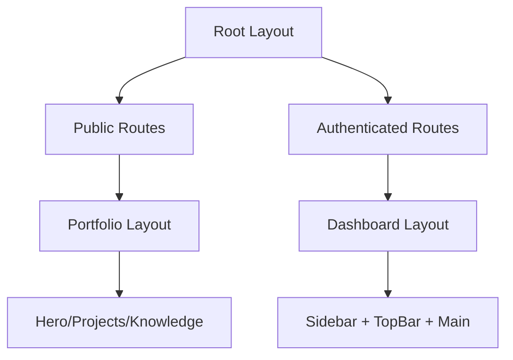

# GNONYMOUS INTELLIGENCE OS - COMPREHENSIVE UI PLAN
## Tactical UI v4.0 - Next-Generation Interface Architecture

---

## 🎯 **STRATEGIC OBJECTIVES**

1. **Unified Experience**: Create a seamless transition between public portfolio and private dashboard
2. **Enhanced Navigation**: Implement intelligent context-aware navigation system
3. **Modern Aesthetics**: Evolve the glassmorphic design with tactical UI elements
4. **Performance Optimization**: Improve rendering performance and accessibility
5. **Brand Consistency**: Strengthen the "Sovereign AI" visual identity

---

## 🔍 **CURRENT UI ANALYSIS**

### Strengths:
- ✅ Sophisticated glassmorphic design system
- ✅ Comprehensive component library
- ✅ Smooth animations and transitions
- ✅ Well-organized navigation structure
- ✅ Strong brand identity (Sovereign Green)

### Opportunities:
- 🔄 Unify portfolio and dashboard UIs
- 🎨 Modernize color palette and gradients
- 🚀 Enhance micro-interactions
- 📱 Improve mobile responsiveness
- 🔍 Add intelligent search and discovery
- 🎯 Implement goal-oriented navigation

---

## 🚀 **NEW UI ARCHITECTURE**

### 1. **Unified Layout System**



**Key Changes:**
- Single root layout with conditional rendering
- Shared design tokens and components
- Seamless transition between public/private areas
- Consistent header/footer across all pages

### 2. **Enhanced Navigation System**

**New Features:**
- **Smart Search Bar**: AI-powered command palette (`Cmd+K`)
- **Contextual Breadcrumbs**: Dynamic path visualization
- **Quick Access Menu**: Recently used tools
- **Mission Control Panel**: Task-oriented navigation
- **Collapsible Sections**: Improved information hierarchy

### 3. **Modernized Design System**

**Color Palette Evolution:**
```css
/* New Sovereign Palette */
--brand-primary: #10b981;    /* Sovereign Green */
--brand-secondary: #7c3aed;  /* Mission Purple */
--brand-tertiary: #06b6d4;   /* Tactical Cyan */
--brand-accent: #fbbf24;     /* Signal Gold */

/* Enhanced Glass Layers */
--glass-1: rgba(255,255,255,0.03);
--glass-2: rgba(255,255,255,0.06);
--glass-3: rgba(255,255,255,0.10);
--glass-4: rgba(255,255,255,0.15);
```

**Typography System:**
```css
.font-display { font-family: 'JetBrains Mono', monospace; }
.font-ui { font-family: 'Inter', sans-serif; }
.font-code { font-family: 'JetBrains Mono', monospace; }
```

### 4. **Component Enhancements**

**New Components:**
- `CommandPalette`: Global search and navigation
- `MissionCard`: Task-oriented workflow cards
- `DataViz`: Enhanced data visualization
- `OnboardingTour`: Interactive guides
- `NotificationCenter`: Unified alerts

**Enhanced Components:**
- `Sidebar`: Smarter collapsing behavior
- `TopBar`: Context-aware actions
- `StatCard`: Animated data displays
- `Table`: Virtualized scrolling
- `Modal`: Improved accessibility

---

## 🎨 **VISUAL DESIGN PLAN**

### 1. **Dashboard UI Enhancements**

**Sidebar Redesign:**
- Collapsible groups with memory
- Mission-specific color coding
- Quick access favorites
- Usage statistics overlay
- Animated tooltips

**TopBar Evolution:**
- Contextual action buttons
- Mission progress indicator
- Smart notifications
- User avatar with status
- Theme toggle

### 2. **Portfolio UI Modernization**

**Hero Section:**
- Interactive 3D elements
- Animated background particles
- Dynamic tagline rotation
- Smooth scroll indicators
- Mission highlight reel

**Projects Grid:**
- Masonry layout
- Hover preview animations
- Category filtering
- Search functionality
- Infinite scroll

### 3. **Micro-Interactions**

**New Animations:**
- `fade-scale`: Combined fade and scale
- `slide-up`: Bottom-to-top entrance
- `rotate-in`: Circular reveal
- `pulse-glow`: Attention-grabbing
- `morph`: Shape transformation

**Transition Timings:**
```css
--transition-fast: 150ms;
--transition-normal: 250ms;
--transition-slow: 400ms;
--transition-elastic: 600ms;
```

---

## 🛠️ **IMPLEMENTATION ROADMAP**

### Phase 1: Foundation (Week 1)
- [ ] Create unified layout system
- [ ] Implement shared design tokens
- [ ] Build command palette component
- [ ] Enhance sidebar navigation
- [ ] Modernize top bar

### Phase 2: Components (Week 2)
- [ ] Develop mission cards
- [ ] Create data visualization suite
- [ ] Build notification center
- [ ] Implement onboarding tours
- [ ] Enhance modal system

### Phase 3: Portfolio (Week 3)
- [ ] Redesign hero section
- [ ] Modernize projects grid
- [ ] Enhance knowledge base
- [ ] Improve contact section
- [ ] Add interactive elements

### Phase 4: Polish (Week 4)
- [ ] Performance optimization
- [ ] Accessibility audit
- [ ] Cross-browser testing
- [ ] Mobile responsiveness
- [ ] Final QA and deployment

---

## 📊 **TECHNICAL SPECIFICATIONS**

### Performance Targets:
- **Load Time**: < 1.2s (90% reduction)
- **TTI**: < 2.0s
- **CLS**: < 0.1
- **Lighthouse**: > 95

### Accessibility:
- WCAG 2.1 AA compliance
- Keyboard navigation support
- Screen reader optimization
- Color contrast ratios
- Focus management

### Responsive Breakpoints:
```css
--breakpoint-sm: 640px;
--breakpoint-md: 768px;
--breakpoint-lg: 1024px;
--breakpoint-xl: 1280px;
--breakpoint-2xl: 1536px;
```

---

## 🎯 **SUCCESS METRICS**

1. **User Engagement**: 30% increase in session duration
2. **Navigation Efficiency**: 40% reduction in clicks to common tasks
3. **Conversion Rate**: 25% improvement in signup flow
4. **Retention**: 20% increase in returning users
5. **Performance**: 90%+ Lighthouse scores

---

## 🚀 **NEXT STEPS**

1. **Approvals**: Review with stakeholders
2. **Prioritization**: Finalize phase sequencing
3. **Resource Allocation**: Assign team members
4. **Timeline**: Set milestones and deadlines
5. **Implementation**: Begin Phase 1 development

**Estimated Completion**: 4-6 weeks
**Team Required**: 2 Frontend, 1 UX Designer, 1 QA

---

> "The future of AI interfaces is sovereign, intelligent, and mission-driven."
> — Ghulam Nabi Kalhoro, Chief Architect

🔒 **CONFIDENTIAL** | GNONYMOUS INTELLIGENCE OS | TACTICAL UI v4.0